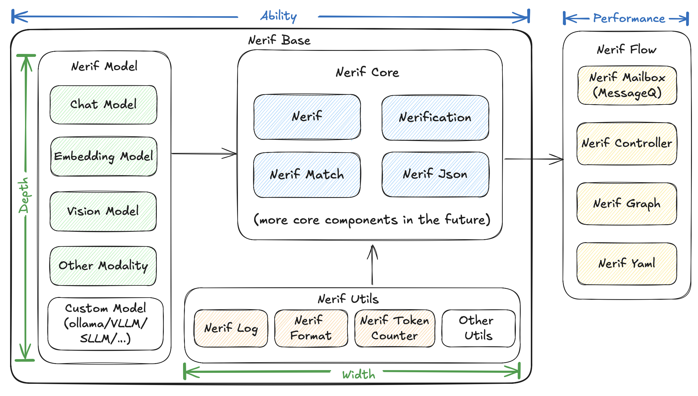

# Nerif Architecture

This section introduces the core design of Nerif, part by part. Here is a general map:

### Nerif Model

Nerif Model provides flexibility in utilizing various AI models, including multi-modal capabilities. Our framework supports models that can interact with external APIs and tools for enhanced functionality.

Currently supported capabilities:
- **LLM chat models** (`SimpleChatModel`) - text generation with conversation history
- **Multi-modal input** (`MultiModalMessage`) - images, audio, and video alongside text
- **Tool calling** (`ToolDefinition`, `ToolCallResult`) - OpenAI-compatible function calling
- **Structured output** - JSON mode via `response_format` parameter
- **Vision models** (`VisionModel`, `VideoModel`) - dedicated image and video analysis
- **Audio models** (`AudioModel`) - speech-to-text transcription
- **Embedding models** (`SimpleEmbeddingModel`, `OllamaEmbeddingModel`) - text embeddings
- **Streaming** (`stream_chat()`, `astream_chat()`) - real-time token-by-token output
- **Async API** (`achat()`, `aembed()`, `agenerate()`) - native async/await support
- **Retry mechanism** (`RetryConfig`) - automatic retry with exponential backoff

### Nerif Agent

The agent framework (`NerifAgent`) provides a ReAct-style (Reason → Act → Observe) loop for multi-step tool calling. Register `Tool` objects with the agent, and it will automatically:
1. Reason about which tool to use
2. Execute the tool and observe results
3. Repeat until a final answer is produced

See [Agent Framework](./model/nerif-agent-framework.md) for details.

### Nerif Core

The key distinction between `model` and `core` lies in their type system implementation. While LLM/VLM models typically generate natural language outputs that require complex post-processing, Nerif Core ensures the outputs are properly typed and immediately usable in your applications.

Nerif Core uses a **three-tier matching approach**:

1. **Logits mode** - Uses the LLM's logprobs API for fast, direct token probability analysis
2. **Structured output mode** - Falls back to JSON-formatted structured responses
3. **Embedding mode** - Uses embedding similarity comparison as the final fallback

:::note
As of v1.1, embedding is optional. When no embedding model is configured, Nerif falls back to text-based matching, allowing `nerif()` and `nerif_match()` to work without requiring an embedding API key.
:::

Core functionality consists of these essential modules:

1. **Nerif**: Evaluates statements and returns boolean values (`True`/`False`)
2. **Nerification**: Validates statements with boolean responses (`True`/`False`)
3. **Nerif Match**: Takes a statement and a list as input, returning the index of the best-matching item
4. **Nerif Format**: Handles type conversion between different formats, including JSON parsing
5. **Nerif Log**: Provides comprehensive logging capabilities

### Nerif Batch

The Batch API module provides OpenAI-compatible batch processing for handling large volumes of requests asynchronously at reduced cost.

### Nerif Flow

This feature will be available after the v1.0 release.
