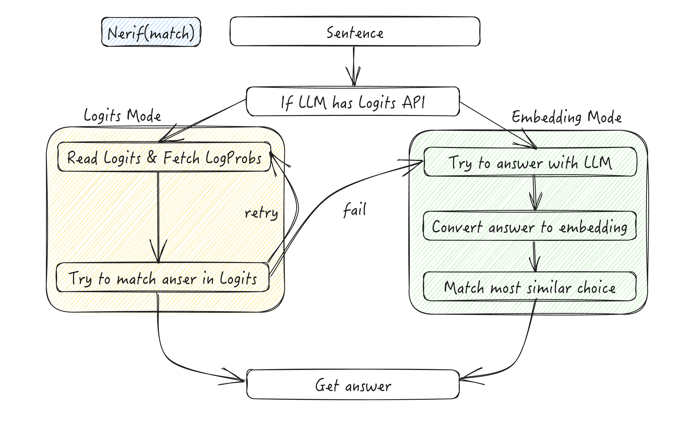

# Nerif Core

Nerif 项目中的核心组件包括 `nerification`、`nerif` 和 `nerif_match`。

## Nerification

Nerification := Not only Verification（不仅仅是验证）

基类：NerificationBase

此类用于验证 Nerif 的输出结果。它提供了将值与预定义的可能值集合进行验证和匹配的基础功能。

属性：

- `original_options (List[Any])`：转换前的原始可能值列表
- `possible (List[str])`：转换为小写字符串的可能值列表
- `embedding (SimpleEmbeddingModel)`：用于生成嵌入向量的模型

方法：

- `convert(val: Any) -> str`：将值转换为小写字符串格式

- `verify(val: Any) -> bool`：检查值是否存在于可能值列表中

- `simple_fit(val: Any)`：使用嵌入向量查找最接近的匹配值

- `force_fit(val: Any, similarity="cosine")`：使用嵌入向量查找最接近的匹配值

基于以上基础方法，我们实现了不同的值检查策略：

`Nerification`、`NerificationInt` 和 `NerificationString`

示例：

```python
from nerif.core import Nerification
from nerif.core import NerificationInt
from nerif.core import NerificationString

nerification = Nerification(model="text-embedding-3-large")

print(nerification.simple_fit("yes, it is"))
# result: None
print(nerification.force_fit("yes, it is"))
# result: True
print(nerification.simple_fit("true"))
# result: True
print(nerification.force_fit("true"))
# result: True

nerification_int = NerificationInt(model="text-embedding-3-large", possible_values=[1, 233, 343])

print(nerification_int.simple_fit(1))
# result: 1
print(nerification_int.force_fit(1))
# result: 1
print(nerification_int.simple_fit(233))
# result: 233
print(nerification_int.force_fit("The value is 233"))
# result: 233
print(nerification_int.simple_fit(343))
# result: 343
print(nerification_int.force_fit("The value is 343"))
# result: 343

nerification_string = NerificationString(model="text-embedding-3-large", possible_values=["YES", "NO"])

print(nerification_string.simple_fit("yes"))
# result: YES
print(nerification_string.force_fit("Well, I guess you are right"))
# result: YES
print(nerification_string.simple_fit("no"))
# result: NO
print(nerification_string.force_fit("Oh, I don't think so"))
# result: NO
```

## Nerif 与 Nerif Match



### 概述

Nerif 和 Nerif Match 组件提供了控制和解释 LLM 输出的健壮机制。它们通过双模式方法（logits 模式和嵌入模式）来解决常见问题，如过于冗长的回复或不一致的格式。

### 工作原理

LLM 的输出有时是不可预测的——它们可能包含不必要的客套话或无关信息。为了处理这些情况，我们采用了两种策略：

1. **Logits 模式**
   - 使用 LLM 的 logits API 获取概率最高的前 k 个 token 输出
   - 速度更快，但可能不够精确
   - 并非所有 LLM 服务都支持

2. **嵌入模式**
   - 当 logits 模式失败或不可用时激活（你也可以直接调用嵌入模式）
   - 生成输入的分析结果并与可能的选项进行嵌入向量比较
   - 更可靠但速度较慢
   - 保证一次尝试即可得到结果

上面的工作流程图展示了这一过程。

### Nerif 类

Nerif 类使用 logits 模式和嵌入模式来评估语句的真实性。

**属性：**
- `model: str` - LLM 模型名称（默认值：NERIF_DEFAULT_LLM_MODEL）
- `embed_model: str` - 嵌入模型名称（默认值：NERIF_DEFAULT_EMBEDDING_MODE）
- `temperature: float` - 模型温度参数，默认为 0
- `counter: Optional[NerifTokenCounter]` - Token 用量计数器
- `debug: bool` - 调试模式标志

**关键方法：**
- `logits_mode(text: str) -> bool` - 使用 logits 分析进行评估
- `embedding_mode(text: str) -> bool` - 使用嵌入向量比较进行评估
- `judge(text: str, max_retry: int = 3) -> bool` - 主要评估方法
- `instance(text: str, max_retry: int = 3, model: str = NERIF_DEFAULT_LLM_MODEL, debug: bool = False) -> bool` - 创建并运行一个新实例

示例：

```python
from nerif.core import Nerif, nerif

# Quick one-shot usage
result = nerif("the sky is blue")
print(result)  # True

# Instance-based usage with custom model
judge = Nerif(model="gpt-4o", debug=True)
result = judge.judge("Python is a compiled language")
print(result)  # False
```

### Nerif Match 类

Nerif Match 类从选项列表中选择最佳匹配项。

**属性：**
- `choices: List[str]` - 可供匹配的选项列表
- `model: str` - LLM 模型名称（默认值：NERIF_DEFAULT_LLM_MODEL）
- `embed_model: str` - 嵌入模型名称（默认值：NERIF_DEFAULT_EMBEDDING_MODEL）
- `temperature: float` - 模型温度参数，默认为 0
- `counter: Optional[NerifTokenCounter]` - Token 用量计数器

**关键方法：**
- `logits_mode(text: str) -> int` - 使用 logits 分析进行匹配
- `embedding_mode(text: str) -> int` - 使用嵌入向量比较进行匹配
- `match(text: str, max_retry: int = 3) -> int` - 主要匹配方法
- `instance(choices: List[str], text: str, max_retry: int = 5, model: str = NERIF_DEFAULT_LLM_MODEL, embed_model: str = NERIF_DEFAULT_EMBEDDING_MODEL, debug: bool = False, counter: Optional[NerifTokenCounter] = None) -> int` - 创建并运行一个新实例

示例：

```python
from nerif.core import NerifMatchString, nerif_match_string

# Quick one-shot usage
choices = ["iPhone 5", "iPhone 6", "iPhone 12"]
idx = nerif_match_string(selections=choices, text="Which iPhone is the most powerful one?")
print(f"Best match: {choices[idx]}")  # iPhone 12

# Instance-based usage
matcher = NerifMatchString(choices=["sunny", "rainy", "cloudy"])
idx = matcher.match("The weather is warm and bright")
print(f"Weather: {choices[idx]}")
```

### 即时模式

有时为了快速使用，我们可以启动即时模式。在 Nerif 项目中，我们提供了 2 个函数来简化 API 调用：`nerif` 和 `nerif_match`。
